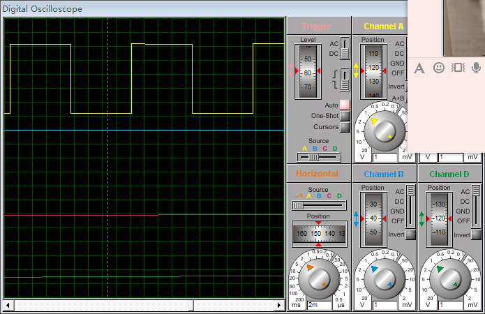

# ming_msl

Ming_MSL 协议（Ming Serial Logic）是一种基于 NRZ-T 编码（Non-Return-to-Zero Time encoding） 的单线、低速、周期型、可扩展双向的串行通信协议。
它特别适合用于数据变化缓慢、对时序要求不高的场景，通信电路简洁、易于实现，且具备良好的抗干扰能力。


| 项目          | 内容说明                                                     |
| ----------- | -------------------------------------------------------- |
| **协议类型**    | 单线异步串行通信协议，仅使用 1 根 SDA 信号线                               |
| **编码方式**    | **NRZ-T**（Non-Return-to-Zero with Time Encoding）         |
| **极性策略**    | 每个 bit 的 SDA 电平极性由其位序（奇偶性）决定：<br>奇数位为高，偶数位为低             |
| **位值判断**    | 电平保持的时长表示 bit 值：<br>`5 tick` 表示 `0`，`10 tick` 表示 `1`     |
| **帧结构**     | `起始位`（低5+高5） → `数据位 × N` → `停止位`（低5+高5） → `帧间隔`（25 tick） |
| **tick 时钟** | 每 tick 通常为 `1ms`，由系统定时器或分频器产生                            |
| **传输位宽**    | 默认 8 bit，可配置扩展为 4/16/32 bit 等                            |
| **通信方向**    | 默认单向主发从收，结构支持扩展为带握手的**双向通信**                             |
| **通信速率**    | 每 bit 最短 5ms，典型帧传输时间为几十毫秒，**适合低速、状态类通信**                 |
| **应用场景**    | 慢速传感器数据采集、低频控制命令发出、MCU/FPGA 简单互联                         |
| **抗干扰性**    | 时序宽松、结构稳健、硬件实现简单，逻辑分析仪和示波器调试方便                           |


# 移植
实现如下3个函数
``` c++
//读引脚电平
typedef int(MslPinRead)(uint8_t id);
//改引脚电平
typedef void (MslPinWrite)(uint8_t id,uint8_t v);
//改引脚方向
typedef void (MslPinDir)(uint8_t id,uint8_t v);
```


# 四种工作模式
``` c++
typedef enum {
    MSL_MODE_MASTER = 0,        // 主机模式
    MSL_MODE_SLAVE,             // 从机模式
    MSL_MODE_MASTER_ONLY_SEND,  // 仅发送模式
    MSL_MODE_SLAVE_ONLY_RECEIVE // 仅接收模式
} MslMode_TypeDef;
```

# 三种对外事件
``` c++
typedef enum {
    MSL_EVENT_SEND = 0,         // 发送完成事件
    MSL_EVENT_RECEIVE ,         // 接收完成事件
    MSL_EVENT_ERROR             // 错误事件
} MSL_Event_TypeDef;
```

# 通讯位宽
``` markdown
 2到32之间的偶数
```

# 目录结构
ming_msl
│  README.md
│─src
│    ├─cpp
│    │      MingMsl.cpp
│    │      MingMsl.h
│    │
│    └─verilog
│            msl_master_sender.v
│            msl_slave_receiver.v
│            tb.v
│
├─examples
│  ├─clion_esp32_wokwi
│  ├─fpga_sim
│  ├─keil_c51
│  └─proteus


# 时序图




