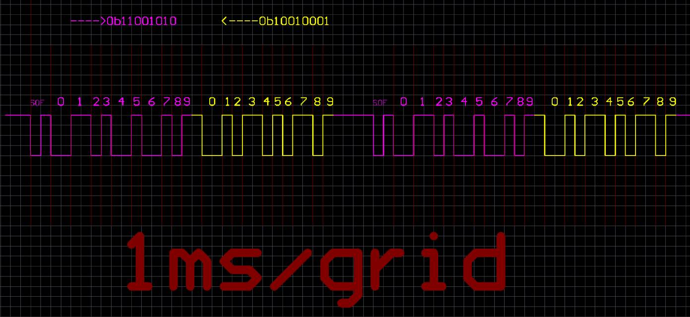
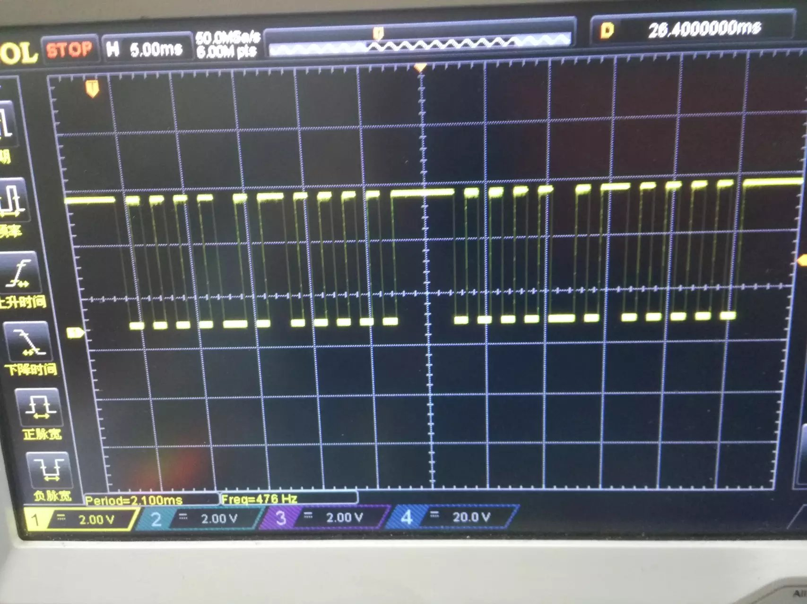
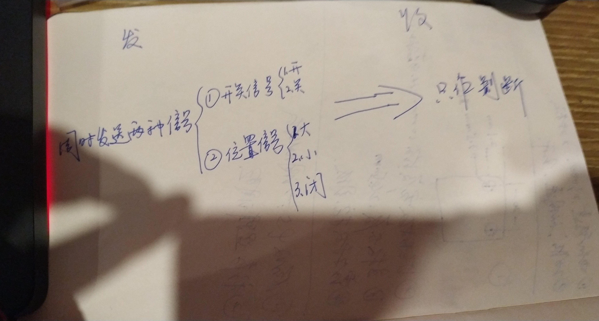
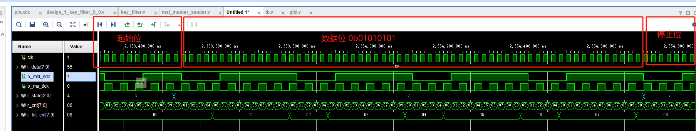

# ming_msl

[Ming_MSL](https://github.com/minglie/ming_msl) 协议（Ming Serial Logic）是一种基于 NRZ-T 编码（Non-Return-to-Zero Time encoding） 的单线、低速、周期性、可拓展为双向通信的串行通信协议。
该协议特别适用于数据变化缓慢、对时序依赖要求不高的场景，具备电路简洁、易于实现、抗干扰能力强等优势。


| 项目          | 内容说明                                                     |
| ----------- | -------------------------------------------------------- |
| **协议类型**    | 单线异步串行通信协议，仅使用 1 根 SDA 信号线                               |
| **编码方式**    | **NRZ-T**（Non-Return-to-Zero with Time Encoding）         |
| **极性策略**    | 每个 bit 的 SDA 电平极性由其位序（奇偶性）决定：<br>奇数位为低，偶数位为高             |
| **位值判断**    | 通过电平保持时长编码 bit 值：<br>`5 tick` 表示 `0`，`10 tick` 表示 `1`     |
| **帧结构**      | `起始位`（低5+高5） → `数据位 × N` → `停止位`（低5+高5） → `帧间隔`（25 tick） |
| **tick 时钟**   | 每 tick 通常为 `1ms`，由系统定时器或分频器产生                            |
| **传输位宽**    | 默认 8 bit，可配置扩展为 4/16/32 bit 等,位宽在主从之间需一致配置                            |
| **通信方向**    | 默认单向主发从收，结构支持扩展为带握手的**双向通信**                             |
| **通信速率**    | 自定义,默认每 bit 最短 5ms，典型帧传输时间为几十毫秒，**适合低速、状态类通信**                 |
| **应用场景**    | 慢速传感器数据采集、低频控制命令发出、MCU/FPGA简单互联                         |
| **抗干扰性**    | 接收方7~10tick都认定为1, 因此时序宽松、结构稳健、硬件实现简单                      |
| **自恢复机制**  | 通讯线被剪断时主从可感知异常，连接恢复后通信自动重建 |

# wokwi 在线演示
[wokwi演示](https://wokwi.com/projects/436060085417312257)

# 移植
为实现跨平台兼容，Ming_MSL 提供 4 个底层函数指针接口。  
其中 `id` 参数用于区分多实例（如多个通信通道或设备）：
## 移植接口
``` c++
// 读取 SDA 引脚电平（0 或 1）
typedef int  (MslPinRead)(uint8_t id);

// 设置 SDA 引脚电平（0 或 1）
typedef void (MslPinWrite)(uint8_t id, uint8_t v);

// 设置 SDA 引脚方向（0：输出，1：输入）
typedef void (MslPinDir)(uint8_t id, uint8_t v);

// 接收事件回调（如接收到数据、发送完成或错误）
typedef void (MslOutEvent)(uint8_t id,MSL_Event_TypeDef eventType, uint32_t data);
```


## 四种工作模式
``` c++
typedef enum {
    MSL_MODE_MASTER = 0,        // 主机模式
    MSL_MODE_SLAVE,             // 从机模式
    MSL_MODE_MASTER_ONLY_SEND,  // 仅发送模式
    MSL_MODE_SLAVE_ONLY_RECEIVE // 仅接收模式
} MslMode_TypeDef;
```

## 三种对外事件
``` c++
typedef enum {
    MSL_EVENT_SEND = 0,         // 发送完成事件
    MSL_EVENT_RECEIVE ,         // 接收完成事件
    MSL_EVENT_ERROR             // 错误事件
} MSL_Event_TypeDef;
```


# 目录结构


```markdown
ming_msl
│  README.md
│─src
│    ├─cpp
│    │      MingMsl.cpp
│    │      MingMsl.h
│    │
│    └─verilog
│            msl_master_sender.v
│            msl_slave_receiver.v
│            tb.v
│
├─examples
│  ├─clion_esp32_wokwi
│  ├─fpga_sim
│  ├─keil_c51
│  └─proteus
```


本项目已实现：

 C++ 主从 [MingMsl.h](src/cpp/MingMsl.h)

 Verilog 主  [msl_master_sender.v](src/verilog/msl_master_sender.v)

 Verilog 从  [msl_master_sender.v](src/verilog/msl_slave_receiver.v)


# 时序图


## 8bit位宽通讯波形
> 紫色是主机控制总线
黄色是从机控制总线




## 单向应用场景


## 8bit位宽 ila 波形



# 帧时长示例（8bit 数据帧）

起始位：10 tick  
数据位：8 bit × 平均 7.5 tick = 60 tick  
停止位：10 tick  
帧间隔：25 tick  
**总计约：105 tick ≈ 105 ms（tick = 1 ms 时）**
说明：该延迟对“状态类控制”“慢速周期采集”等应用可接受。


# 设计理念


Ming_MSL 提供了一种**结构简洁、易于移植、波形清晰、无外部时钟依赖**的通用单线通信协议。  
它特别适用于**资源受限设备**、**低速场景**，适合芯片之间进行**状态类信息的传递**，例如控制命令、状态刷新、事件触发等。

该协议不追求高带宽，不推荐用于大数据量的高速传输场合，更**适合用于状态,命令 而非数据的传输**的情境。


## 类似协议对比
Ming_MSL 的最大优势是对时序不敏感，具备天然的误差容忍能力，避免误差累积。
它采用“电平持续时间”来表达 bit 值，允许 ±数 ms 的偏差，即使中断打断、定时不准也能正确通信。

相比之下，常见软件 UART 若主从波特率略有偏差，或中断延迟，就容易产生误码。而 DS18B20 等协议则对时序极度敏感，需 µs 级精度，移植和稳定性都不易保证。

## 串口对比
| 特性        | UART 串口                  | Ming\_MSL 协议                |
| --------- | ------------------------ | --------------------------- |
| **引脚数**   | 至少 2 根（TXD + RXD）        | 仅 1 根 SDA                   |
| **通信速率**  | 常见为 9600\~115200 bps     | 典型每 bit ≥ 5ms，帧级通信，低速稳定     |
| **时钟依赖**  | 基于波特率计时，主从需严格时钟同步        | 完全不依赖外部时钟，同步由时间宽度隐式编码       |
| **波形结构**  | 边沿敏感，波形需精准对齐，易被干扰影响      | 电平持续时间判断位值，容忍 ±数 ms 抖动，抗干扰强 |
| **硬件支持**  | 需 UART IP、波特率器、FIFO、寄存器等 | 任意 GPIO + 软件定时即可，无需硬件支持     |
| **应用场景**  | 中速数据交互（如模块通信、终端打印）       | 慢速状态/命令传输（如控制信号、状态刷新）       |
| **实现复杂度** | 协议栈、校验位、帧格式相对复杂          | 极简起始位/停止位 + 时长判位，结构简单       |
| **芯片兼容性** | 大多数 MCU/FPGA 有硬件 UART    | 任意平台皆可实现，仅需读写 SDA 电平和方向控制接口 |

## 高级扩展

以下三类扩展机制在提升协议灵活性、拓展适用场景的同时，
也可能带来通信速率的下降、硬件资源要求或软件解析复杂度的增加。
适用于对协议功能性有更高需求的系统环境。

### 🌐 星型一主多从通信
  需要从传输位宽拿出几位来标识从机
``` 
         +-----------+
         |           |
         |  Master   |
         |           |
         +-----+-----+
               |
               |
     +---+  +--+  +--+  +--+  +--+
     | S1|  |S2|  |S3|  |S4|  |S5| ...
     +---+  +--+  +--+  +--+  +--+
```
### ⏱️ 动态波特率与节奏编码
Ming_MSL 协议基于“电平跳变 + tick 时间长度”的时间编码原理，
从设备可在起始位或结束位的跳变处测量 SDA 电平的持续时间，从而自动推导出当前帧的 tick 基准。

该特性可被扩展为“节奏编码通道”，即通过 tick 长度隐式携带帧级元信息

### 🎛 使用 ADC 采样 SDA 信号
得益于 Ming_MSL 协议**极低的传输速率、稳定的信号节奏、基于持续时间的编码机制**，接收端 不依赖于高速数字IO口 或 中断系统。
SDA 信号甚至可直接叠加在 DC 电源线上，通过串入电阻、电容耦合与钳位保护等手段提取 SDA 波形，
实现“电源线+信号线”复用，简化系统布线


本协议及其参考实现代码完全开源，欢迎移植、修改。


> 作者：minglie  
> 协议版本：v1.0  
> 更新时间：2025-07-12  