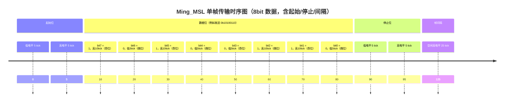

# ming_msl

Ming_MSL 协议（Ming Serial Logic）是一种基于 NRZ-T 编码（Non-Return-to-Zero Time encoding） 的单线、低速、周期性、可拓展为双向通信的串行通信协议。
该协议特别适用于数据变化缓慢、对时序依赖要求不高的场景，具备电路简洁、易于实现、抗干扰能力强等优势。


| 项目          | 内容说明                                                     |
| ----------- | -------------------------------------------------------- |
| **协议类型**    | 单线异步串行通信协议，仅使用 1 根 SDA 信号线                               |
| **编码方式**    | **NRZ-T**（Non-Return-to-Zero with Time Encoding）         |
| **极性策略**    | 每个 bit 的 SDA 电平极性由其位序（奇偶性）决定：<br>奇数位为高，偶数位为低             |
| **位值判断**    | 电平保持的时长表示 bit 值：<br>`5 tick` 表示 `0`，`10 tick` 表示 `1`     |
| **帧结构**     | `起始位`（低5+高5） → `数据位 × N` → `停止位`（低5+高5） → `帧间隔`（25 tick） |
| **tick 时钟** | 每 tick 通常为 `1ms`，由系统定时器或分频器产生                            |
| **传输位宽**    | 默认 8 bit，可配置扩展为 4/16/32 bit 等,位宽在主从之间需一致配置                            |
| **通信方向**    | 默认单向主发从收，结构支持扩展为带握手的**双向通信**                             |
| **通信速率**    | 每 bit 最短 5ms，典型帧传输时间为几十毫秒，**适合低速、状态类通信**                 |
| **应用场景**    | 慢速传感器数据采集、低频控制命令发出、MCU/FPGA 简单互联                         |
| **抗干扰性**    | 时序宽松、结构稳健、硬件实现简单，逻辑分析仪和示波器调试方便                           |


# 移植
为实现跨平台兼容，Ming_MSL 提供 4 个底层函数指针接口。  
其中 `id` 参数用于区分多实例（如多个通信通道或设备）：
## 移植接口
``` c++
// 读取 SDA 引脚电平（0 或 1）
typedef int  (MslPinRead)(uint8_t id);

// 设置 SDA 引脚电平（0 或 1）
typedef void (MslPinWrite)(uint8_t id, uint8_t v);

// 设置 SDA 引脚方向（0：输出，1：输入）
typedef void (MslPinDir)(uint8_t id, uint8_t v);

// 接收事件回调（如接收到数据、发送完成或错误）
typedef void (MslOutEvent)(uint8_t id,MSL_Event_TypeDef eventType, uint32_t data);
```


## 四种工作模式
``` c++
typedef enum {
    MSL_MODE_MASTER = 0,        // 主机模式
    MSL_MODE_SLAVE,             // 从机模式
    MSL_MODE_MASTER_ONLY_SEND,  // 仅发送模式
    MSL_MODE_SLAVE_ONLY_RECEIVE // 仅接收模式
} MslMode_TypeDef;
```

## 三种对外事件
``` c++
typedef enum {
    MSL_EVENT_SEND = 0,         // 发送完成事件
    MSL_EVENT_RECEIVE ,         // 接收完成事件
    MSL_EVENT_ERROR             // 错误事件
} MSL_Event_TypeDef;
```


# 目录结构
```markdown
ming_msl
│  README.md
│─src
│    ├─cpp
│    │      MingMsl.cpp
│    │      MingMsl.h
│    │
│    └─verilog
│            msl_master_sender.v
│            msl_slave_receiver.v
│            tb.v
│
├─examples
│  ├─clion_esp32_wokwi
│  ├─fpga_sim
│  ├─keil_c51
│  └─proteus
```


# 时序图



# 设计理念


Ming_MSL 提供了一种**结构简洁、易于移植、波形清晰、无外部时钟依赖**的通用单线通信协议。  
它特别适用于**资源受限设备**、**低速场景**，适合芯片之间进行**状态类信息的传递**，例如控制命令、状态刷新、事件触发等。

该协议不追求高带宽，不推荐用于大数据量的高速传输场合，更**适合用于状态传授而非数据传输**的情境。

本协议及其参考实现代码完全开源，欢迎移植、修改、反馈与贡献。


> 作者：minglie  
> 协议版本：v1.0  
> 更新时间：2025-07-12  